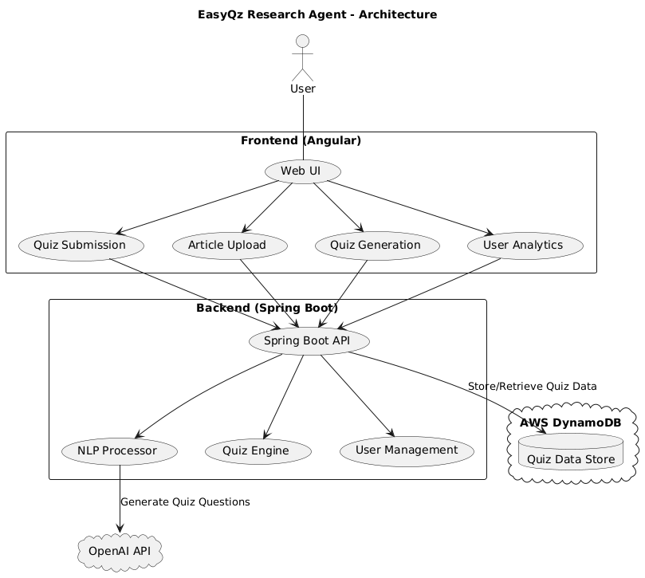

# EasyQZ AI Research Agent 🧠📖

**EasyQz AI Research Agent** is the server side component of EasyQZ and is an AI-powered research assistant that allows users to analyze content, generate quizzes, and test their knowledge. It is built using **Angular (Frontend)**, **Spring Boot (Backend)**, and **AWS DynamoDB (Database)**.

## Live Demo
- **URL**: [EasyQZ](https://easyqz.online)

## Enable EasyQZ for Your Article

To enable EasyQZ for your article, all you need to do is add the following link inside your article. You don't need to do anything else:

```html
<a href="https://vishalmysore.github.io/easyqz/" target="_blank">
  Test with EasyQZ
</a>
```

EasyQz Research Agent helps users conduct research by analyzing articles and generating quizzes from them. It utilizes **AI-powered natural language processing (NLP)** to extract insights and create multiple-choice or adaptive learning quizzes.



### 🌟 Core Features:
- 📝**Automatic Quiz Generation** – Instantly creates quizzes from any article, text, or topic.
- 📊**AI-Powered Questioning** – Generates high-quality, meaningful questions based on the content.
- 📡**Topic-Based Questions** – Simply enter a topic (e.g., *Java, Global Summit, Boating Requirements in Canada*), and EasyQ will generate relevant questions.
-  🏆**Trending Topics** – Discover the *top most asked topics* from the past week.

### 🚀 Advanced Features:
- **Customizable Tests** – Select the *number of questions, difficulty level, or enable rapid-fire mode*.
- **Performance Benchmarking** – See the *average score* for a particular quiz to compare results.
- **Compete with Others** – Pick an opponent and challenge them to a quiz.
- **Social Sharing** – Share your quiz results on LinkedIn and other platforms.
- **Leaderboard & Rankings** – View the *Top 10 results* for a specific quiz.
- **Expert Assistance** – If you don’t understand a question, ask an expert for clarification.
- **User Engagement Insights** – Track *how many users have taken a quiz* for an article.
- **Section-Wise Performance** – Identify *which sections need improvement* based on quiz results.
- **Overall Feedback** – Get a *summary of performance trends* to enhance learning.

### 📊 **User Analytics & Feedback**
- **Performance Tracking**: Monitors progress over multiple quizzes.
- **Personalized Learning Suggestions**: Recommends articles and quizzes based on past performance.
- **Feedback & Improvement**: Provides insights on how to improve quiz scores.
- **User Engagement Metrics**: Tracks the number of quizzes taken, average scores, and more.
- **User Retention & Engagement**: Encourages users to take quizzes regularly.
- 

## Contributions 🤝
Contributions are welcome! Feel free to submit issues, feature requests, or pull requests.

## License 📜
MIT License

## Installation & Usage
- **Installation**: EasyQZ is available as a web application and can be accessed via any modern web browser.
